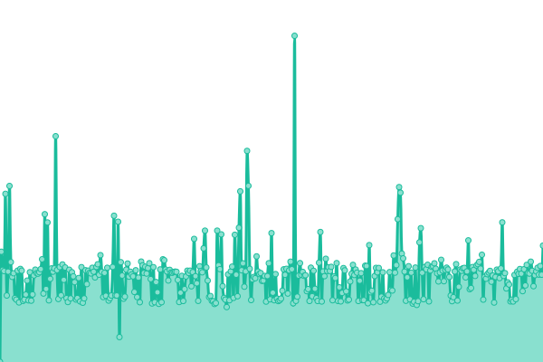
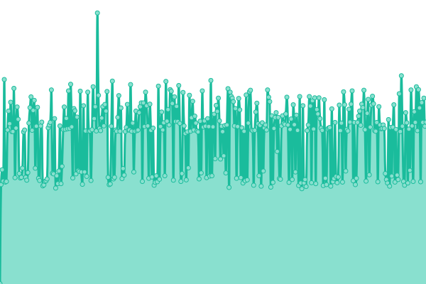

# [📈 Live Status](https://recylink-status.github.io/lollapalooza): <!--live status--> **🟥 Complete outage**

This repository contains the open-source uptime monitor and status page for [recylink-status](https://recylink-status.github.io/lollapalooza), powered by [Upptime](https://github.com/upptime/upptime).

With [Upptime](https://upptime.js.org), you can get your own unlimited and free uptime monitor and status page, powered entirely by a GitHub repository. We use [Issues](https://github.com/recylink-status/lollapalooza/issues) as incident reports, [Actions](https://github.com/recylink-status/lollapalooza/actions) as uptime monitors, and [Pages](https://recylink-status.github.io/lollapalooza) for the status page.

<!--start: status pages-->
<!-- This summary is generated by Upptime (https://github.com/upptime/upptime) -->
<!-- Do not edit this manually, your changes will be overwritten -->
<!-- prettier-ignore -->
| URL | Status | History | Response Time | Uptime |
| --- | ------ | ------- | ------------- | ------ |
|  [Dashboard Lollapalooza](https://lollapalooza.recylink.com/) | 🟥 Down | [dashboard-lollapalooza.yml](https://github.com/recylink-status/lollapalooza/commits/HEAD/history/dashboard-lollapalooza.yml) | 

 0ms
     
 | 

<a href="https://recylink-status.github.io/lollapalooza/history/dashboard-lollapalooza">0.00%</a>
    

|  [Admin Lollapalooza](https://admin-lollapalooza.recylink.com/login) | 🟥 Down | [admin-lollapalooza.yml](https://github.com/recylink-status/lollapalooza/commits/HEAD/history/admin-lollapalooza.yml) | 

 0ms
     
 | 

<a href="https://recylink-status.github.io/lollapalooza/history/admin-lollapalooza">0.00%</a>
    

|  [API Lollapalooza](https://api-lollapalooza.recylink.com/v1/health) | 🟥 Down | [api-lollapalooza.yml](https://github.com/recylink-status/lollapalooza/commits/HEAD/history/api-lollapalooza.yml) | 

 0ms
     
 | 

<a href="https://recylink-status.github.io/lollapalooza/history/api-lollapalooza">0.00%</a>
    

<!--end: status pages-->

[**Visit our status website →**](https://recylink-status.github.io/lollapalooza)

## 📄 License

- Powered by: [Upptime](https://github.com/upptime/upptime)
- Code: [MIT](./LICENSE) © [recylink-status](https://recylink-status.github.io/lollapalooza)
- Data in the `./history` directory: [Open Database License](https://opendatacommons.org/licenses/odbl/1-0/)
